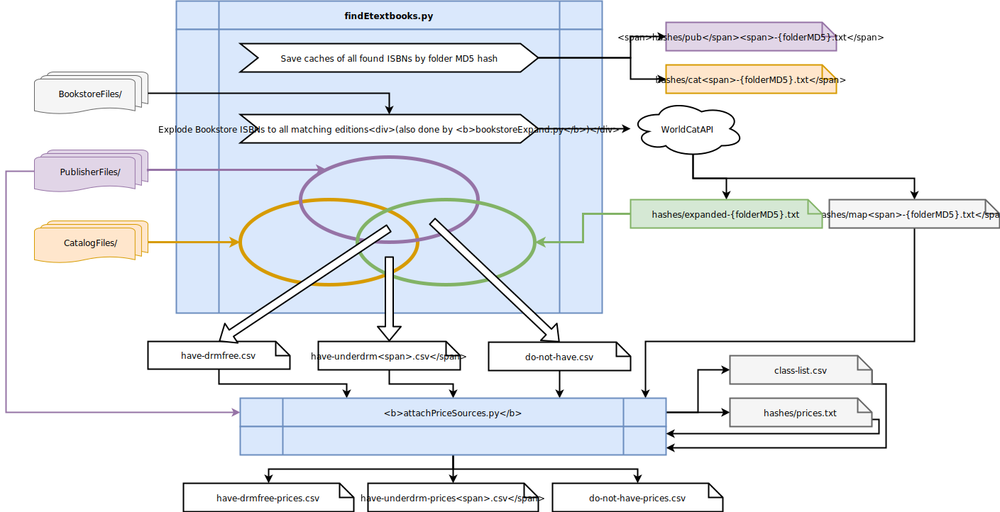

# etextbooksearch

> Lovingly forked and heavily based upon [https://github.com/myqua/etextbooksearch](https://github.com/myqua/etextbooksearch)

## Sources

Formatting is more about compatibility with the current system, not optimization. Found ISBNs are sorted and hashed into

| Folder | Input description |
|--------|-------------------|
| CatalogFiles/   | Any plain text format. We use a plain list of ISBNs. |
| PublisherFiles/ | Either Excel or any plain text format. ISBNs are discovered automatically, regardless of layout. |
| BookstoreFiles/ | JSON array of book objects: ```JS
{
  "title": "The Bride of the Tomb",
  "isbn": "9781486484157",
  "price": 18.83,
  "classes": [
    {
      "code": "ENG 404",
      "prof": "MILLER, Alex. McVeigh" // Name format doesn't matter
    }
  ]
}
``` |

## Scripts

### findEtextbooks.py

### bookstoreExpand.py

### attachPricesSources.py




## Generated Files

### do-not-have.csv

### have-drmfree.csv

### have-underdrm.csv

### \*-prices.csv

### class-list.csv

### hashes/

## TODO

- Finish README
- Optimization: Store hashes in Python binary format (marshal)
