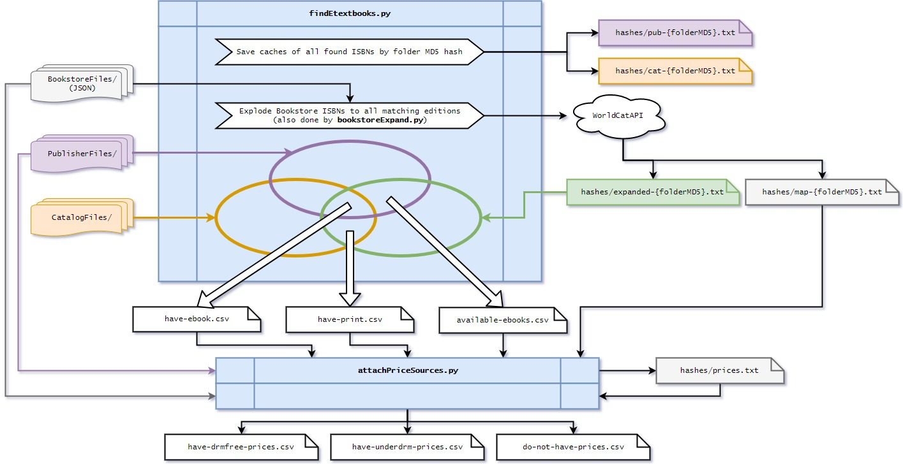

# etextbooksearch

> Lovingly forked and heavily based upon [https://github.com/myqua/etextbooksearch](https://github.com/myqua/etextbooksearch)

All scripts built for **Python 3.x**.

## Sources

Formatting is more about compatibility with the current system, not optimization. Found ISBNs are sorted and hashed into a hashes/ directory.

| Folder | Input description | Format |
|--------|-------------------|--------|
| CatalogFiles/   | All ebook and physical books currently in the collection | Any plain text format. We use a plain list of ISBNs. |
| PublisherFiles/ | "All" available ebooks | Either Excel or any plain text format. ISBNs are discovered automatically, regardless of layout. |
| BookstoreFiles/ | All books required for courses this semester | JSON array of book objects (format below) |
```JS
{
  "title": "The Bride of the Tomb",
  "isbn": "9781486484157",
  "price": 18.83,
  "classes": [
    {
      "code": "ENG 404",
      "prof": "MILLER, Alex. McVeigh" // Name format doesn't matter
    }
  ]
}
```

## Scripts

### findEtextbooks.py

Takes all of your input files and outputs comparison files.

- Hashes ISBNs to a 'hashes/' folder.
- Expands all ISBNs from BookstoreFiles/ using the WorldCat api
  - saved in expanded-hash
  - map-hash stores the ISBN and its results on separate lines for comparison later
- Expands ISBN with metadata from WorldCat

| Filename          | Description |
|-------------------|-------------|
| do-not-have.csv   | All the ISBNs that were in expanded BookstoreFiles/ and PublisherFiles/, but not CatalogFiles/. |
| have-underdrm.csv | All the ISBNs that were in expanded BookstoreFiles/ and CatalogFiles/, but not PublisherFiles/. |
| have-drmfree.csv  | ISBNs that were in all three. |

### bookstoreExpand.py

Only does the WorldCat ISBN expansion, always overwriting the appropriate expanded-hash cache file.

### attachPricesSources.py

Adds price, source, and class information to the three comparison files. Creates csv's with isbn,price,source,metdata, and classes info (in that order). Naming convention is {source file name}-prices.csv.



## TODO

- Optimization: Store hashes in Python binary format (marshal)
